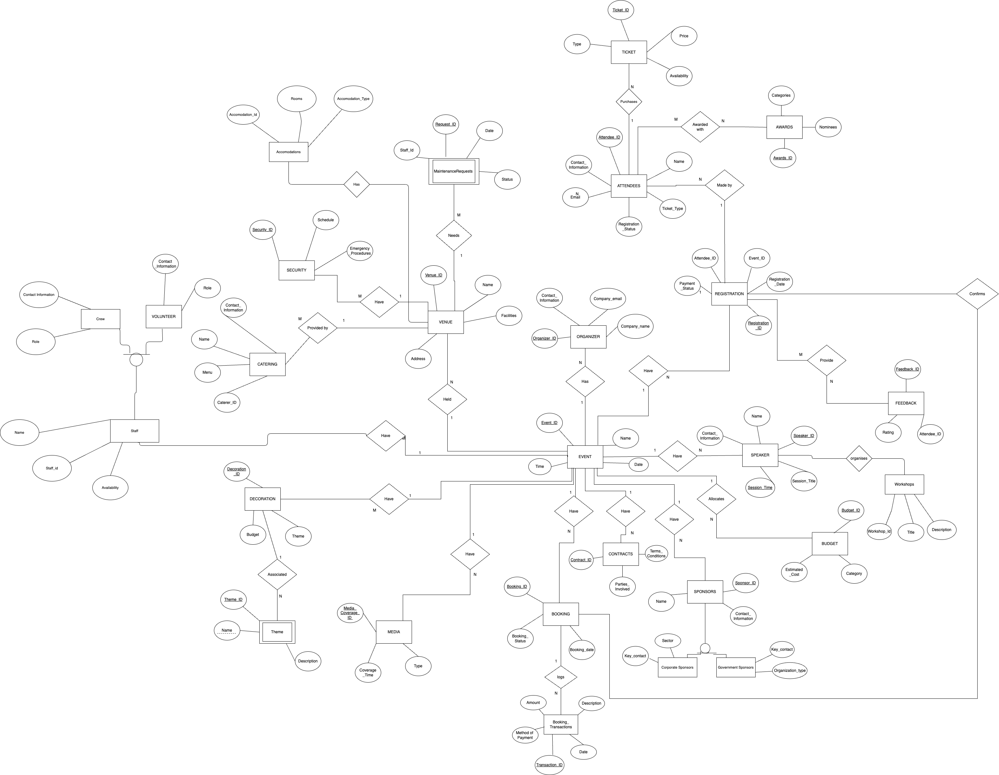
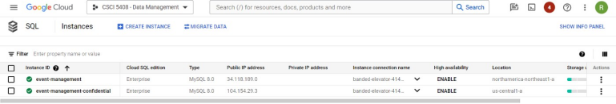
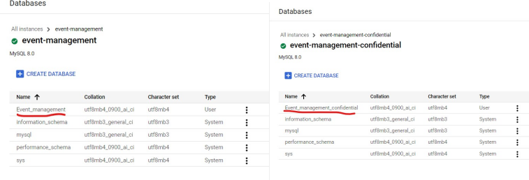
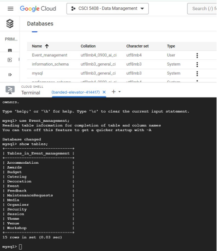
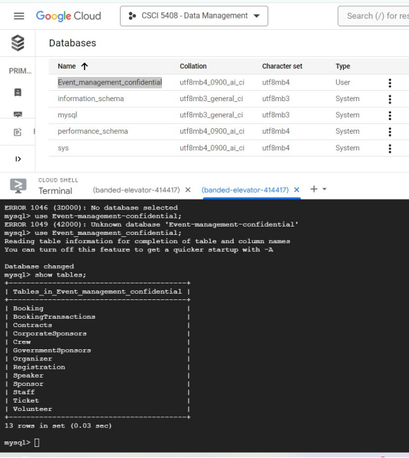
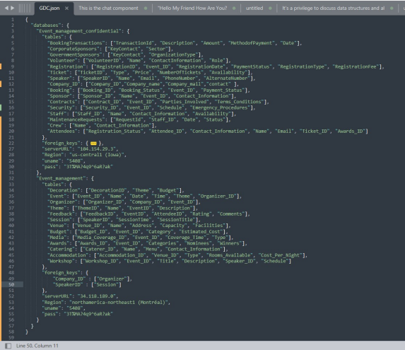

# Hospitality Management Distributed Database

## Overview

The Event Management System (EMS) Database is designed to streamline the planning, coordination, and execution of events within the hospitality industry. This system integrates various aspects of event management, including booking, registration, feedback collection, budgeting, and more. The project leverages Google Cloud Platform (GCP) for data storage and management, with a distributed database approach for enhanced security and efficiency.

## Features

- **Event Management**: Create, update, and manage events, including details such as date, time, theme, and organizer.
- **Attendee Management**: Track attendees, their registration status, and ticket types.
- **Venue Management**: Manage venue details, including capacity and facilities.
- **Budget Management**: Track budgets for events, including estimated costs and categories.
- **Booking and Transactions**: Handle bookings, payments, and transaction history.
- **Speaker and Session Management**: Manage speakers and their sessions, including scheduling and topics.
- **Feedback Collection**: Collect and analyze feedback from attendees.
- **Security and Catering**: Manage security arrangements and catering services.
- **Volunteers and Staff**: Track volunteer and staff information, including roles and availability.
- **Accommodation**: Manage accommodations for attendees.
- **Media Coverage**: Track media coverage of events.

## Database Architecture

   

### Fragmentation and Distributed Database Approach

The Event Management System employs a distributed database architecture to manage data efficiently and securely. The system is divided into two main databases with a specific fragmentation strategy to enhance performance and security:

1. **Event_Management Database**
   - **Purpose**: Stores non-sensitive information related to events, venues, attendees, feedback, etc.
   - **Fragmentation**: Data is partitioned by event types and venue details to optimize query performance and management.
   - **Tables**: Includes tables for events, organizers, attendees, venues, feedback, and more.

2. **Event_Management_confidential Database**
   - **Purpose**: Stores sensitive information, including booking transactions, attendee personal information, and security details.
   - **Fragmentation**: Data is partitioned by sensitivity levels and transaction types to ensure data protection and compliance.
   - **Tables**: Includes tables for booking transactions, sensitive attendee information, security procedures, and more.









### Global Data Catalog (GDC)

- **Purpose**: Maintains a global catalog of all databases, including metadata and access controls.
- **Location**: Stored in the `Event_Management_confidential` instance.
- **Encoding**: GDC content is encoded in base64 to enhance security.



### ERD (Entity-Relationship Diagram)

- **[Insert ERD Here]**

### Example Fragmentation

**Event_Management Database**:
```sql
-- Table for Event Management
CREATE TABLE Event (
    Event_ID INT PRIMARY KEY,
    Name VARCHAR(255),
    Date DATE,
    Time TIME,
    Theme VARCHAR(255),
    Organizer_ID INT,
    Venue_ID INT,
    FOREIGN KEY (Organizer_ID) REFERENCES Organizer(Organizer_ID),
    FOREIGN KEY (Venue_ID) REFERENCES Venue(Venue_ID)
);

-- Table for Venue Management
CREATE TABLE Venue (
    Venue_ID INT PRIMARY KEY,
    Name VARCHAR(255),
    Capacity INT,
    Location VARCHAR(255)
);
```

**Event_Management_confidential Database**:
```sql
-- Table for Booking Transactions
CREATE TABLE Booking_Transactions (
    Transaction_ID INT PRIMARY KEY,
    Event_ID INT,
    Attendee_ID INT,
    Amount DECIMAL(10, 2),
    Transaction_Date DATE,
    FOREIGN KEY (Event_ID) REFERENCES Event(Event_ID),
    FOREIGN KEY (Attendee_ID) REFERENCES Attendee(Attendee_ID)
);

-- Table for Sensitive Attendee Information
CREATE TABLE Sensitive_Attendee_Info (
    Attendee_ID INT PRIMARY KEY,
    Name VARCHAR(255),
    Email VARCHAR(255),
    Phone VARCHAR(20),
    Address TEXT
);
```

## Setup and Installation

1. **Clone the Repository**:
   ```bash
   git clone https://github.com/your-repo/event-management-system.git
   cd event-management-system
   ```

2. **Setup Database**:
   - **Event_Management Database**:
     - Create the database using the provided SQL scripts.
     - Ensure proper fragmentation and distribution of data as per the architecture described.
   - **Event_Management_confidential Database**:
     - Create the database using the provided SQL scripts.
     - Ensure proper encryption and access controls are implemented.

3. **Run the Application**:
   - Configure application properties to connect to the GCP instances.
   - Start the application using your preferred IDE or command line.
